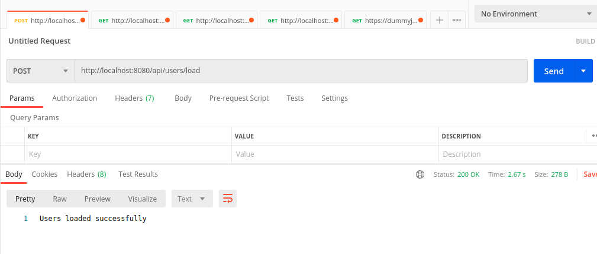
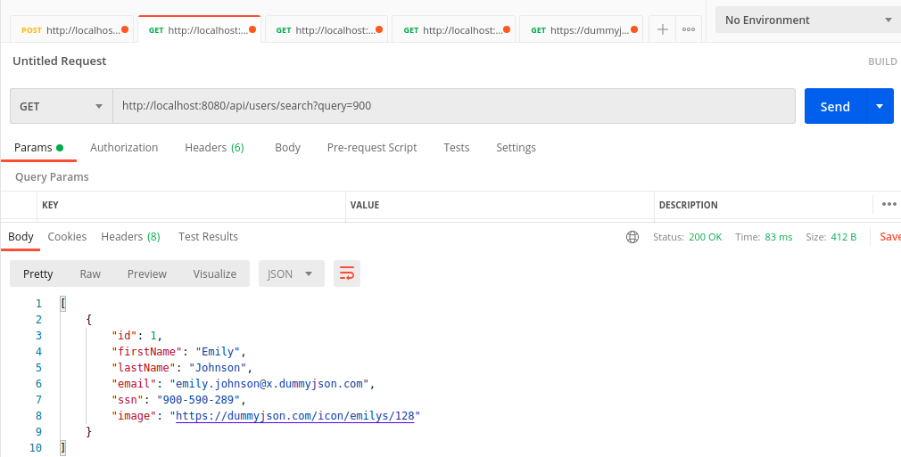
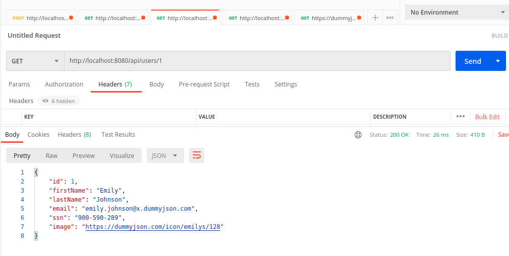
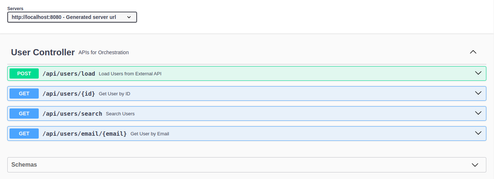

# Assignment Overview
- **Java 21 Spring Boot Application** for Orchestration.
- Fetches and stores users from **`dummyjson.com/users`**.

## APIs Implemented
1. **Load Users** → `POST /users/load` (Fetch from external API)
2. **Search Users** → `GET /users/search?query={name}`
3. **Find by ID** → `GET /users/{id}`
4. **Find by Email** → `GET /users/email/{email}`

## Key Features
- **Resilience4j** for Circuit Breaker & Bulkhead.
- **Swagger Documentation** (`/swagger-ui.html`).
- **Exception Handling** via `GlobalExceptionHandler`.
- **JUnit & Mockito** for testing.

## Working Flow

1. **Load Users** →

2. **Search Users** →

3. **Find by ID** →

4. **Swagger Documentation** →

